# Frontend

### <mark style="background-color:orange;">**HTML/CSS**</mark>

* [https://www.youtube.com/watch?v=Ejkb\_YpuHWs\&list=PLHz\_AreHm4dkZ9-atkcmcBaMZdmLHft8n](https://www.youtube.com/watch?v=Ejkb\_YpuHWs\&list=PLHz\_AreHm4dkZ9-atkcmcBaMZdmLHft8n)

## <mark style="background-color:green;">Node.js</mark>

* [https://learn.microsoft.com/en-us/azure/app-service/quickstart-nodejs](https://learn.microsoft.com/en-us/azure/app-service/quickstart-nodejs)
* [https://azure.microsoft.com/pt-br/products/cosmos-db](https://azure.microsoft.com/pt-br/products/cosmos-db)

Antes de saber mais sobre o Next e React, é importante etender o que é o Node.js já que é importante tê-lo na hora da instalação.

* O node.js é uma runtime de JavaScript

Ou seja, uma biblioteca usada por u compilador durante a execução do programa;

Possibilitando criar softwares JS no lado do servidor;

* “Ponte” – vê e escreve JS e executa o código em C++ para garantir alta performance (isso porque foi construída na V8 engine da google, que é escrita em C++);

## <mark style="background-color:red;">Npm</mark>

O que é npm:

* **Gerenciador de pacotes** do Node (exemplo- no python utilizamos o pip, cada linguagem que roda em servidor costuma ter um gerenciador de pacotes para conseguir baixar bibliotecas de terceiros)
* Maioria dos projetos que irá criar vão ser iniciados pelo npm (node package manager)
* Executar determinados **scripts** no nosso programa, vários comandos são executados por meio de um (esse é o conceito de scripts do npm)
* Os módulos externos ficam em uma pasta **node\_modules** (pasta padrão de projeto, é onde as bibliotecas de terceiros vão ficar)

Não vai ser influenciável no projeto, debe ser descartável, ou seja, a cada instalação do projeto baixamos todos os pacotes novamente e não vai alterar o código

## <mark style="background-color:yellow;">Next</mark>

* [https://nextjs.org/docs](https://nextjs.org/docs)

**React** é a biblioteca para construção de aplicações frontend com Javascript.

**Next** veio para ter um framework, uma estrutura que construa sua aplicação, framework React para aplicação.

Criação de conteúdo estático e do lado do servidor.

Trabalha com três tipos de renderização:

* Cliente
* Server
* Estático

## [**Principais Características**](https://nextjs.org/docs#main-features)

Alguns dos principais Next.js as características incluem:

| Recurso                                                                      | Descrição                                                                                                                                                                                                                                |
| ---------------------------------------------------------------------------- | ---------------------------------------------------------------------------------------------------------------------------------------------------------------------------------------------------------------------------------------- |
| https://nextjs.org/docs/app/building-your-application/routing                | Um sistema de arquivos baseado roteador construído no topo de Componentes de Servidor que oferece suporte a layouts, aninhada de roteamento, o carregamento de estados, tratamento de erros, e muito mais.                               |
| https://nextjs.org/docs/app/building-your-application/rendering              | Do lado do cliente e o Processamento do lado do Servidor com os Componentes de Cliente e Servidor. Mais otimizada com a Estática e a Dinâmica de Processamento no servidor com Next.js. Streaming na Borda e Node.js tempos de execução. |
| https://nextjs.org/docs/app/building-your-application/data-fetching          | Simplificado de busca de dados com async/await em Componentes de Servidor, e um longo fetch API para solicitação de memoization, o cache de dados e revalidação.                                                                         |
| https://nextjs.org/docs/app/building-your-application/styling                | Suporte para o seu estilo preferido métodos, incluindo CSS Módulos, Tailwind CSS, e CSS-no-JS                                                                                                                                            |
| https://nextjs.org/docs/app/building-your-application/optimizing             | Imagem, tipos de Letra, e o Script de Otimizações para melhorar o seu aplicativo do Núcleo Web órgãos vitais e Experiência do Usuário.                                                                                                   |
| https://nextjs.org/docs/app/building-your-application/configuring/typescript | Suporte melhorado para Transcrito, com o melhor tipo de verificação e mais eficiente de compilação, bem como os usos Transcrito Plugin e tipo verificador.                                                                               |

### _**Criando o Projeto:**_

* Node instalado (node –version)
* **mkdir** – criar pasta
* **cd** nomePasta
* **npx create-next-app nomeProjeto** (não instala global)
* **cd** nome Projeto
* **code .**
* **npm run dev**


## _<mark style="background-color:blue;">**React:**</mark>_

* [https://react.dev/learn](https://react.dev/learn)
* [https://medium.com/tableless/o-guia-completo-do-react-e-o-seu-ecossistema-b31a10ecd84f](https://medium.com/tableless/o-guia-completo-do-react-e-o-seu-ecossistema-b31a10ecd84f)
* npx create-react-app nomeProjeto
* cd nomeProjeto
* npm start


**React** é a biblioteca para construção de aplicações frontend com Javascript.

Tipo de aplicação conhecido como SPA (Single Page Aplication) – Aplicação de página única, ou seja, um arquivo html para sua aplicação inteira e o resto é gerado pelo Javascript.

→ Muda apenas o que precisa ser mudado

Quando um componente precisa ser alterado, por exemplo, e essa alteração irá impactar os componentes filhos, o React controla quais alterações foram feitas e em quais componentes e renderiza o DOM do navegador somente com o que foi alterado.

Exemplo:

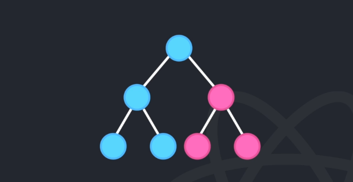

Primeiro é necessário saber oque é DOM:

Quando uma página da web é carregada, o navegador cria uma hierarquia dos objetos chamada de Modelo de Documento por Objetos → Document Object Model

* Os aplicativos React são feitos de componentes:

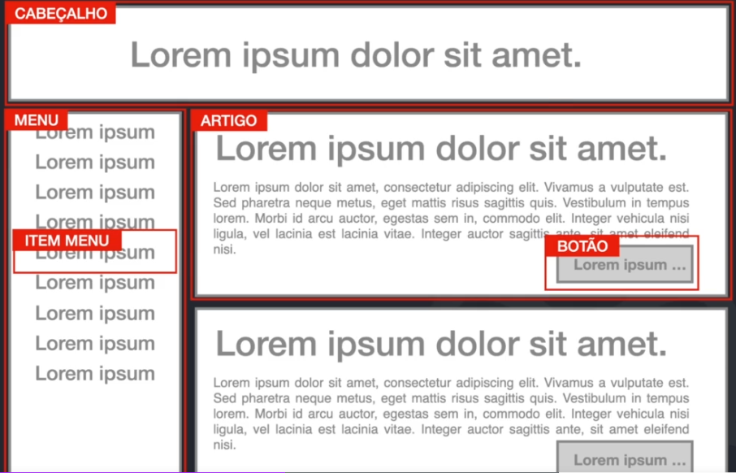

* Os componentes React são funções JavaScript que retornam marcação.

→ Permitem dividir a interface em partes independentes, reutilizáveis e pensar em cada parte isoladamente.

* O React não é um _framework_, mas uma biblioteca (_library_).
* O React serve para criar interfaces visuais ([UI](https://en.wikipedia.org/wiki/User\_interface)).

Exemplos criando um componente:

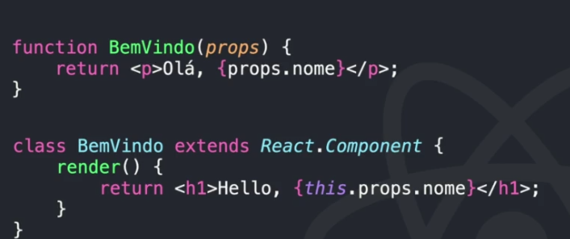

Renderizando Componentes →

Chamada de tag:

Os atributos são passados para dentro de propriedade e depois para o componente, e lá será como um objeto, e no DOM quando for renderizar ira passar conforme foi “pedido”.

* As propriedades são só somente leitura, não se pode alterar, somente exibir as informações na tela

_Exemplo:_

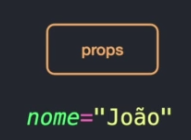

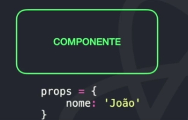

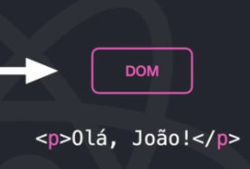

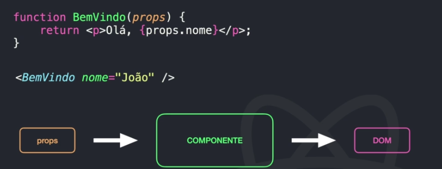

As propriedades (props) são só somente leitura, não se pode alterar, exibir as informações na tela

Compondo Componentes

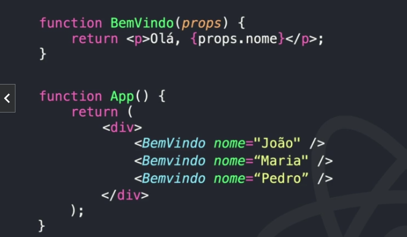

Como são reutilizáveis, podemos chamar vários componentes passando apenas parâmetros diferentes

React e o seu ecossistema:

* React
* JSX
* ES2015
* Webpack
* Flux/Redux
* axios/fetch
* Jest/Mocha

Para criar as aplicações em React vamos utilizar um executor de scripts do Node, que é o **npx** (executar o script que está no repositório do npm, que inicia os pacotes)

* Comando: **npx create-react-app nomeProjeto –** nova aplicação sendo gerada
* Para iniciar: **npm start** (roda o script dentro do package json que vai iniciar a aplicação)

**Estrutura base**

* **Node\_modules:** onde as dependências do projeto ficam
* **Public:** assets estáticos e HTMl de inicialização
* **Src:** onde vamos programar nossas apps
* **Src/index.js:** arquivo de inicialização do React (como funciona o carregamento – index é linkado ao html e esse html chama o js que chama o react)
* **Src/App.js:** componente principal da aplicação

**JSX:**

JSX é uma extensão de sintaxe do JavaScript, que nos permite escrever HTML dentro do JavaScript.

Usado para descrever a interface dos nossos componentes.

Exemplo:

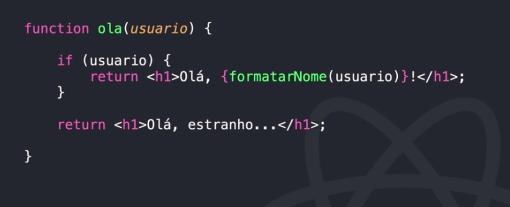

**Atributos com JSX:**

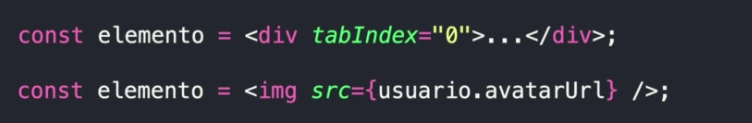

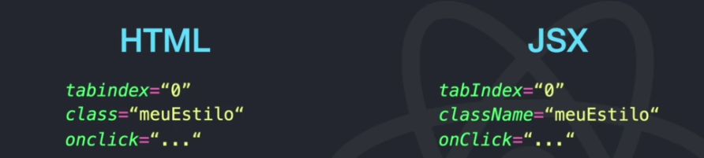

**PROPS X STATE**

Para entender melhor o props:

Exemplo → Hello World

```jsx
import React from 'react';

export default function HelloWorld() {
  return (
    <h1>Hello World</h1>
  );
}
```

Imaginando que precisamos mudar a mensagem ‘World’ para alguma outra que for enviada dinamicamente, podemos reescrever esse componente usando as _props_ dessa forma:

```jsx
import React from 'react';

export default function HelloWithProps(props) {
  return (
    <h1>Hello {props.name}</h1>
  );
}
```

E com isso feito, podemos chamar esse componente dentro de outros assim:

```jsx
import React from 'react';

import HelloWithProps from './hello-with-props';

export default function App() {
  return (
    <div>
      <HelloWithProps name="World" />
      <HelloWithProps name="Brazil" />
    </div>
  );
}
```

Além disso, podemos fazer uma validação das _props_ que são passadas no componente para evitar _bugs_ desnecessários e facilitar no desenvolvimento da aplicação usando os [PropTypes](https://www.npmjs.com/package/prop-types):

```jsx
import React from 'react';
import PropTypes from 'prop-types';

export default function HelloWithProps(props) {
  return (
    <h1>Hello {props.name}</h1>
  );
}

HelloWithProps.propTypes = {
   name: PropTypes.string.isRequired,
};
```

Agora, informamos explicitamente ao React para apenas aceitar a _prop_ quando ela for uma _string_. Se qualquer outra coisa for passada para esse componente, a aplicação irá falhar e receberemos uma mensagem de erro nos avisando o porquê.

State → Estado

State peretence ao componente, pode alterar mas dentro do componente

É possível passar o estado de um componente para o outro através do props (propriedade)

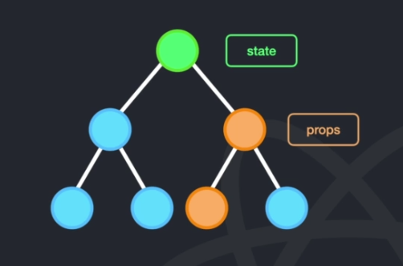

**Dica:**

**Extensão – ES7 + React/Redux/React-Native snippets** (criar códigos com alguns atalhos)

* [Windows](https://code.visualstudio.com/shortcuts/keyboard-shortcuts-windows.pdf): Ctrl+P

**Exemplo:**

* Hello World – React app


* [https://www.youtube.com/watch?v=hd2B7XQAFls](https://www.youtube.com/watch?v=hd2B7XQAFls)

## <mark style="background-color:purple;">Vi</mark>_<mark style="background-color:purple;">**te:**</mark>_

* [https://pt.vitejs.dev/guide/](https://pt.vitejs.dev/guide/)
* npm create vite@latest – executa os scripts do vite na sua última versão
* cd nomeProjeto
* npm install
* npm run dev

**Exemplo:**

* Hello World – Vite


