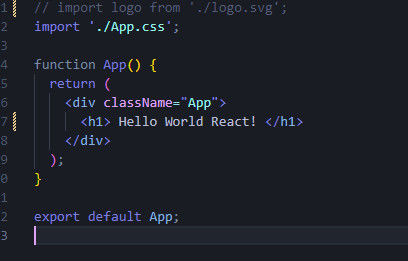
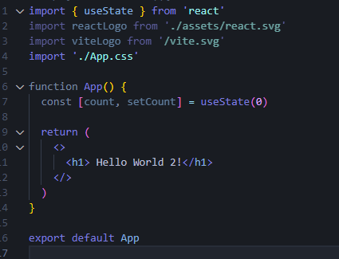

# Frontend

[Para acessar meu GitBook caso queira ver melhor!](https://julinha.gitbook.io/frontend/)

## Frontend

#### <mark style="background-color:orange;">**HTML/CSS/JS**</mark>









### <mark style="background-color:green;">Node.js</mark>





Antes de saber mais sobre o Next e React, é importante etender o que é o Node.js já que é importante tê-lo na hora da instalação.

* O node.js é uma runtime de JavaScript

Ou seja, uma biblioteca usada por u compilador durante a execução do programa;

Possibilitando criar softwares JS no lado do servidor;

* “Ponte” – vê e escreve JS e executa o código em C++ para garantir alta performance (isso porque foi construída na V8 engine da google, que é escrita em C++);

### <mark style="background-color:red;">Npm</mark>

O que é npm:

* **Gerenciador de pacotes** do Node (exemplo- no python utilizamos o pip, cada linguagem que roda em servidor costuma ter um gerenciador de pacotes para conseguir baixar bibliotecas de terceiros)
* Maioria dos projetos que irá criar vão ser iniciados pelo npm (node package manager)
* Executar determinados **scripts** no nosso programa, vários comandos são executados por meio de um (esse é o conceito de scripts do npm)
* Os módulos externos ficam em uma pasta **node\_modules** (pasta padrão de projeto, é onde as bibliotecas de terceiros vão ficar)

Não vai ser influenciável no projeto, debe ser descartável, ou seja, a cada instalação do projeto baixamos todos os pacotes novamente e não vai alterar o código

### <mark style="background-color:yellow;">Next</mark>



**React** é a biblioteca para construção de aplicações frontend com Javascript.

**Next** veio para ter um framework, uma estrutura que construa sua aplicação, framework React para aplicação.

Criação de conteúdo estático e do lado do servidor.

Trabalha com três tipos de renderização:

* Cliente
* Server
* Estático

### [**Principais Características**](https://nextjs.org/docs#main-features)

Alguns dos principais Next.js as características incluem:

| Recurso                                                                      | Descrição                                                                                                                                                                                                                                |
| ---------------------------------------------------------------------------- | ---------------------------------------------------------------------------------------------------------------------------------------------------------------------------------------------------------------------------------------- |
| https://nextjs.org/docs/app/building-your-application/routing                | Um sistema de arquivos baseado roteador construído no topo de Componentes de Servidor que oferece suporte a layouts, aninhada de roteamento, o carregamento de estados, tratamento de erros, e muito mais.                               |
| https://nextjs.org/docs/app/building-your-application/rendering              | Do lado do cliente e o Processamento do lado do Servidor com os Componentes de Cliente e Servidor. Mais otimizada com a Estática e a Dinâmica de Processamento no servidor com Next.js. Streaming na Borda e Node.js tempos de execução. |
| https://nextjs.org/docs/app/building-your-application/data-fetching          | Simplificado de busca de dados com async/await em Componentes de Servidor, e um longo fetch API para solicitação de memoization, o cache de dados e revalidação.                                                                         |
| https://nextjs.org/docs/app/building-your-application/styling                | Suporte para o seu estilo preferido métodos, incluindo CSS Módulos, Tailwind CSS, e CSS-no-JS                                                                                                                                            |
| https://nextjs.org/docs/app/building-your-application/optimizing             | Imagem, tipos de Letra, e o Script de Otimizações para melhorar o seu aplicativo do Núcleo Web órgãos vitais e Experiência do Usuário.                                                                                                   |
| https://nextjs.org/docs/app/building-your-application/configuring/typescript | Suporte melhorado para Transcrito, com o melhor tipo de verificação e mais eficiente de compilação, bem como os usos Transcrito Plugin e tipo verificador.                                                                               |

#### _**Criando o Projeto:**_

* Node instalado (node –version)
* **mkdir** – criar pasta
* **cd** nomePasta
* **npx create-next-app nomeProjeto** (não instala global)
* **cd** nome Projeto
* **code .**
* **npm run dev**

### _<mark style="background-color:blue;">**React:**</mark>_







* npx create-react-app nomeProjeto
* cd nomeProjeto
* npm start

**React** é a biblioteca para construção de aplicações frontend com Javascript.

Tipo de aplicação conhecido como SPA (Single Page Aplication) – Aplicação de página única, ou seja, um arquivo html para sua aplicação inteira e o resto é gerado pelo Javascript.

→ Muda apenas o que precisa ser mudado

Quando um componente precisa ser alterado, por exemplo, e essa alteração irá impactar os componentes filhos, o React controla quais alterações foram feitas e em quais componentes e renderiza o DOM do navegador somente com o que foi alterado.

**Exemplo:**

* Hello World – React app







### <mark style="background-color:purple;">Vite:</mark>



* npm create vite@latest – executa os scripts do vite na sua última versão
* cd nomeProjeto
* npm install
* npm run dev

**Exemplo:**

* Hello World – Vite

