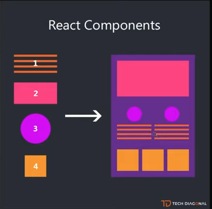

# React

**React** é a biblioteca para construção de aplicações frontend com Javascript.

Tipo de aplicação conhecido como SPA (Single Page Aplication) – Aplicação de página única, ou seja, um arquivo html para sua aplicação inteira e o resto é gerado pelo Javascript.

→ Muda apenas o que precisa ser mudado

Quando um componente precisa ser alterado, por exemplo, e essa alteração irá impactar os componentes filhos, o React controla quais alterações foram feitas e em quais componentes e renderiza o DOM do navegador somente com o que foi alterado.

Exemplo:

<figure><figcaption></figcaption></figure>

Primeiro é necessário saber oque é DOM:

Quando uma página da web é carregada, o navegador cria uma hierarquia dos objetos chamada de Modelo de Documento por Objetos → Document Object Model

* Os aplicativos React são feitos de componentes:

<figure><figcaption></figcaption></figure>

<figure><figcaption></figcaption></figure>

* Os componentes React são funções JavaScript que retornam marcação.

→ Permitem dividir a interface em partes independentes, reutilizáveis e pensar em cada parte isoladamente.

* O React não é um _framework_, mas uma biblioteca (_library_).
* O React serve para criar interfaces visuais ([UI](https://en.wikipedia.org/wiki/User\_interface)).

Exemplos criando um componente:

<figure><figcaption></figcaption></figure>

Renderizando Componentes →

Chamada de tag:

Os atributos são passados para dentro de propriedade e depois para o componente, e lá será como um objeto, e no DOM quando for renderizar ira passar conforme foi “pedido”.

* As propriedades são só somente leitura, não se pode alterar, somente exibir as informações na tela

_Exemplo:_

<figure><figcaption></figcaption></figure>

<figure><figcaption></figcaption></figure>

<figure><figcaption></figcaption></figure>

<figure><figcaption></figcaption></figure>

As propriedades (props) são só somente leitura, não se pode alterar, exibir as informações na tela

Compondo Componentes

<figure><figcaption></figcaption></figure>

Como são reutilizáveis, podemos chamar vários componentes passando apenas parâmetros diferentes

React e o seu ecossistema:

* React
* JSX
* ES2015
* Webpack
* Flux/Redux
* axios/fetch
* Jest/Mocha

Para criar as aplicações em React vamos utilizar um executor de scripts do Node, que é o **npx** (executar o script que está no repositório do npm, que inicia os pacotes)

* Comando: **npx create-react-app nomeProjeto –** nova aplicação sendo gerada
* Para iniciar: **npm start** (roda o script dentro do package json que vai iniciar a aplicação)

**Estrutura base**

* **Node\_modules:** onde as dependências do projeto ficam
* **Public:** assets estáticos e HTMl de inicialização
* **Src:** onde vamos programar nossas apps
* **Src/index.js:** arquivo de inicialização do React (como funciona o carregamento – index é linkado ao html e esse html chama o js que chama o react)
* **Src/App.js:** componente principal da aplicação

**JSX:**

JSX é uma extensão de sintaxe do JavaScript, que nos permite escrever HTML dentro do JavaScript.

Usado para descrever a interface dos nossos componentes.

Exemplo:

<figure><figcaption></figcaption></figure>

**Atributos com JSX:**

<figure><figcaption></figcaption></figure>

<figure><figcaption></figcaption></figure>

**PROPS X STATE**

Para entender melhor o props:

Exemplo → Hello World

```jsx
import React from 'react';

export default function HelloWorld() {
  return (
    <h1>Hello World</h1>
  );
}
```

Imaginando que precisamos mudar a mensagem ‘World’ para alguma outra que for enviada dinamicamente, podemos reescrever esse componente usando as _props_ dessa forma:

```jsx
import React from 'react';

export default function HelloWithProps(props) {
  return (
    <h1>Hello {props.name}</h1>
  );
}
```

E com isso feito, podemos chamar esse componente dentro de outros assim:

```jsx
import React from 'react';

import HelloWithProps from './hello-with-props';

export default function App() {
  return (
    <div>
      <HelloWithProps name="World" />
      <HelloWithProps name="Brazil" />
    </div>
  );
}
```

Além disso, podemos fazer uma validação das _props_ que são passadas no componente para evitar _bugs_ desnecessários e facilitar no desenvolvimento da aplicação usando os [PropTypes](https://www.npmjs.com/package/prop-types):

```jsx
import React from 'react';
import PropTypes from 'prop-types';

export default function HelloWithProps(props) {
  return (
    <h1>Hello {props.name}</h1>
  );
}

HelloWithProps.propTypes = {
   name: PropTypes.string.isRequired,
};
```

Agora, informamos explicitamente ao React para apenas aceitar a _prop_ quando ela for uma _string_. Se qualquer outra coisa for passada para esse componente, a aplicação irá falhar e receberemos uma mensagem de erro nos avisando o porquê.

State → Estado

State peretence ao componente, pode alterar mas dentro do componente

É possível passar o estado de um componente para o outro através do props (propriedade)

<figure><figcaption></figcaption></figure>

**Dica:**

**Extensão – ES7 + React/Redux/React-Native snippets** (criar códigos com alguns atalhos)

* [Windows](https://code.visualstudio.com/shortcuts/keyboard-shortcuts-windows.pdf): Ctrl+P




